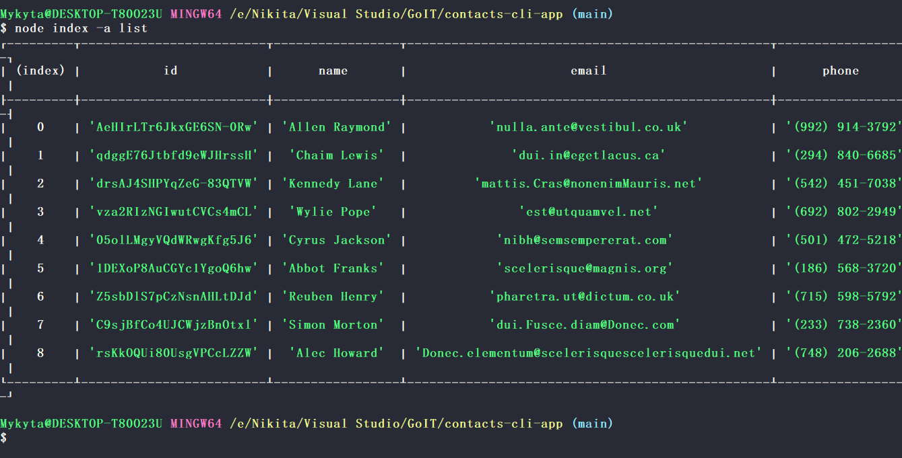
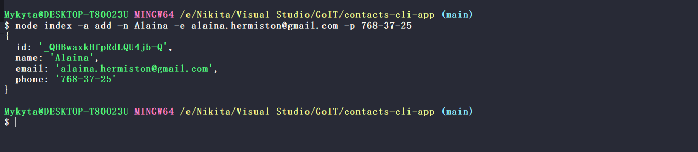
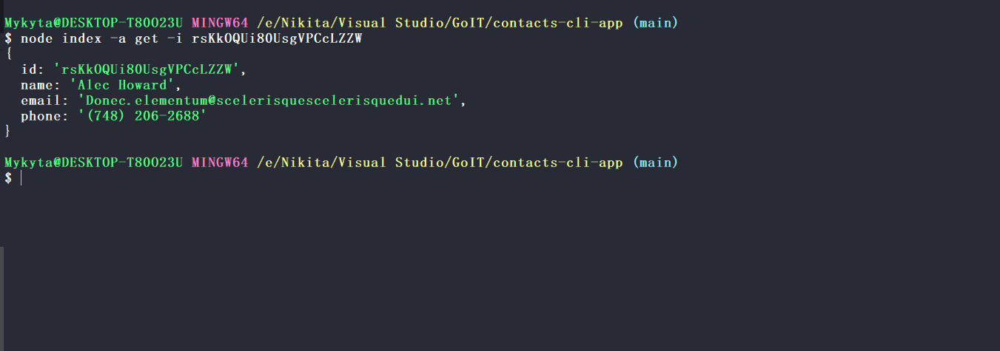
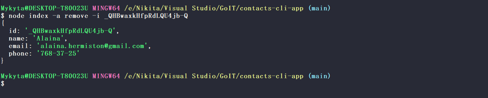

# Welcome to contacts-cli-app 👋

## Built with

-   Node.js
-   Nodemon
-   Commander
-   Nanoid

## Screenshots

-   List command 

-   Add command 

-   Get command 

-   Remove command 

## Author

👤 **Mykyta Pokasiuk**

-   Github: [@mykytapokasiuk](https://github.com/mykytapokasiuk)

## Show your support

Give a ⭐️ if this project helped you!

---

_This README was generated with ❤️ by [readme-md-generator](https://github.com/kefranabg/readme-md-generator)_
